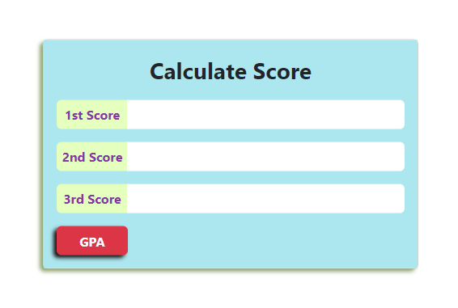
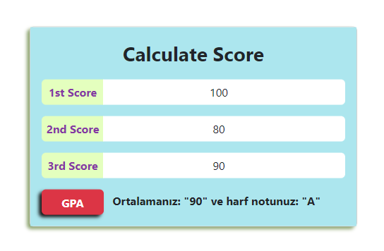
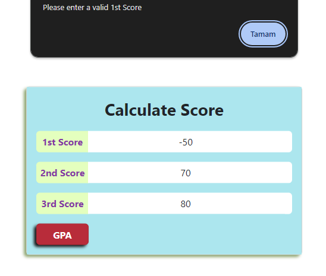
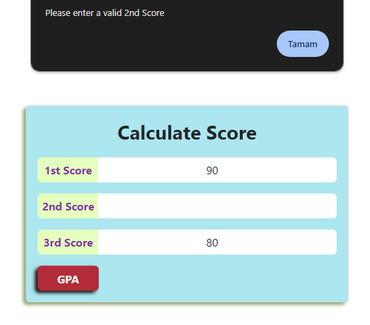

# Not Hesaplama Uygulaması

Bu basit web uygulaması, kullanıcının girdiği üç farklı notu kullanarak not ortalamasını hesaplar ve elde edilen ortalamaya karşılık gelen harf notunu gösterir.

## Ekran Görüntüsü






## Kullanılan Teknolojiler

- HTML
- CSS (Bootstrap kütüphanesi)
- JavaScript

## Nasıl Çalıştırılır?

1. Repoyu bilgisayarınıza kopyalayın:

    ```bash
    git clone https://github.com/SebahattinDemir/not-hesapla.git
    ```

2. Oluşturulan dizine gidin:

    ```bash
    cd proje-adı
    ```

3. `index.html` dosyasını bir web tarayıcısında açın.

## Kullanım

- Sayfa üzerindeki giriş kutularına 1. not, 2. not ve 3. notu girin.
- "GPA" butonuna tıklayın.
- Ortalama ve harf notu sonuçlarını görmek için sonuç alanını kontrol edin.

## Fonksiyonlar

- `isScoreValid`: Girilen notun geçerli olup olmadığını kontrol eder.
- `getAverage`: Girilen üç notun ortalamasını hesaplar.
- `convertScoreToLetter`: Verilen not ortalamasına karşılık gelen harf notunu döndürür.

## Katkıda Bulunma

Eğer projeye katkıda bulunmak istiyorsanız:

1. Bir fork oluşturun.
2. Yeni bir branch oluşturun (`git checkout -b feature/yeni-ozellik`).
3. Değişikliklerinizi commit edin (`git commit -am 'Yeni özellik: XYZ'`).
4. Branch'inizi push edin (`git push origin feature/yeni-ozellik`).

## İletişim

GitHub profilimde bulanan [LinkedIn](https://www.linkedin.com/in/sebahattindemir) hesabım üzerinden benimle iletişime geçebilir ve projeyi geliştirmeme yardımcı olabilirsiniz.
